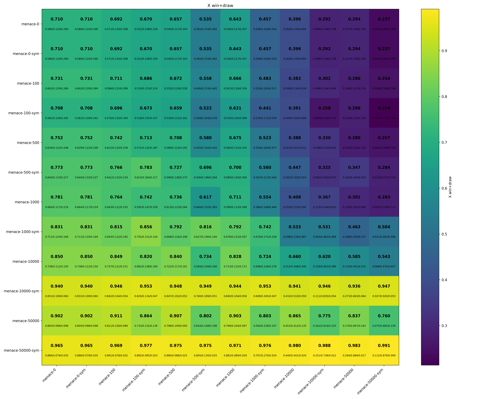

# Final Project Report  
## MENACE in Haskell: A Purely Functional Reinforcement Learning System
### Name: Stella Lee, CNET: kangheelee

## Overview

This project implements **MENACE**, an acronym for **(Matchbox Educable Noughts and Crosses Engine)**, a reinforcement learning system for Noughts and Crosses / Tic-Tac-Toe originally developed by Donald Michie in the 1960s. MENACE learns by associating each board state with a “matchbox” containing weighted moves (beads). After each game, move weights are adjusted according to the outcome: rewarded on wins, slightly rewarded on draws, and penalized on losses.

The goal of this project was to recreate MENACE in Haskell while exploring how reinforcement learning can be modeled in a purely functional setting. (Also because I had attempted to implement MENACE 8 years ago when I first saw a YouTube video by [standupmaths](https://www.youtube.com/watch?v=R9c-_neaxeU), but was unable to do so from my being inexperienced with Java and Python. I viewed this final project as a great opportunity to try implementing the project once again, successfully this time.)

My implementation supports:
- Self-play training (used to train the matchboxes initially)
- Human vs MENACE interaction (Used to play the trained matchboxes after the training)
- Symmetry reduction (rotations, axis of symmetry reduction to reduce the number of matchboxes)
- Configurable learning parameters (i.e. changing reward/penalty values)
- Saving and loading learned state as JSON (as menace.json)

---

## Usage
```sh
cabal run menace-hs -- --help
Usage: menace-hs COMMAND [--symmetry] [--initial-weight ARG] [--win-reward ARG] 
                 [--draw-reward ARG] [--loss-penalty ARG] [--min-weight ARG] 
                 [--games ARG] [--report-every ARG] [--seed ARG] [--human ARG] 
                 [--show-weights] [--color] [--load FILE] [--save FILE] 
                 [--x-load FILE] [--o-load FILE]

Available options:
  --symmetry               Enable symmetry reduction
  --initial-weight ARG     Initial beads per legal move
  --win-reward ARG         Beads added on win
  --draw-reward ARG        Beads added on draw
  --loss-penalty ARG       Beads removed on loss
  --min-weight ARG         Minimum beads per move
  --games ARG              Training games (train) / number of games (duel)
  --report-every ARG       Print stats every N games (train only; currently
                           summary at end)
  --seed ARG               Random seed
  --human ARG              Human plays X or O (play mode)
  --show-weights           Show bead weights during play
  --color                  Colorize X and O (colourblind-friendly)
  --load FILE              Load MENACE JSON (train/play)
  --save FILE              Save MENACE JSON (train/play)
  --x-load FILE            Load MENACE JSON for X (duel)
  --o-load FILE            Load MENACE JSON for O (duel)
  -h,--help                Show this help text

Available commands:
  train                    Self-play training
  play                     Human vs MENACE
  duel                     MENACE vs MENACE (no learning)
```

## Design and Organization

The project is organized into the following files: 

### `Menace.Types`

Defines core data types used across the system:

- `Player`, `Cell`, and `Outcome`
- `BoardKey` (board encoded as a base-3 integer)
- `Matchbox` and `MENACE` (implemented using `IntMap`)
- `Config`, which stores all tunable parameters (rewards, penalties, symmetry flag, seed for picking matches, etc.)

This module centralizes domain modeling and configuration.

---

### `Menace.Board`

Implements the rules/logic of Noughts and Crosses / Tic-Tac-Toe.

Responsibilities:

- Board representation using base-3 encoding  
- Reading and writing cells (`getCell`, `setCell`)  
- Computing legal moves  
- Determining current player  
- Detecting winners and draws  
- Rendering the board in a text UI  

The board is represented as an integer (`BoardKey`), where each digit in base 3 encodes a square (empty, X, or O). This allows compact storage and easy transformation.

---

### `Menace.Symmetry`

Implements the aforementioned symmetry reduction in order to reduce board states and therefore required storage needed for the trained matchboxes (also makes training faster / more reliable or consistent). Tic-Tac-Toe has rotational and reflectional symmetry. Without symmetry reduction, the system would learn separate matchboxes for board states that are equivalent under rotation or reflection.

This module:
- Defines all 8 symmetry transformations  
- Computes a canonical representative of a board  
- Provides forward and inverse move mappings  

---

### `Menace.Engine`

Implements the reinforcement learning system.

Features:
- Ensuring matchboxes exist for new states  
- Selecting moves via weighted random choice  
- Updating bead weights after a game  
- Running self-play training  
- Running human vs MENACE interaction  

The reinforcement learning rule:

- Win -> add beads  
- Draw -> small reward  
- Loss -> remove beads (bounded below by minimum weight)  

All updates return new immutable `MENACE` states, demonstrating how learning can be implemented functionally.

---

### `Menace.Persist`

Handles JSON serialization and deserialization.

Provides:

- `saveMENACE`
- `loadMENACE`

The internal `IntMap` structures are converted to a JSON-friendly format for storage. This allows training to persist across program runs.

---

### `Main`

Provides a command-line interface using `optparse-applicative`.

Supports two modes:

- `train` -> self-play training  
- `play` -> human vs MENACE  

Configurable parameters include:

- Number of training games  
- Reward and penalty values  
- Minimum bead count  
- Random seed  
- Symmetry toggle  
- Save/load file paths  


## Training

```sh
# No symmetry
cabal run menace-hs -- train --games 0 --seed 1 --save menace-0.json
cabal run menace-hs -- train --games 100 --seed 1 --save menace-100.json
cabal run menace-hs -- train --games 500 --seed 1 --save menace-500.json
cabal run menace-hs -- train --games 1000 --seed 1 --save menace-1000.json
cabal run menace-hs -- train --games 10000 --seed 1 --save menace-10000.json
cabal run menace-hs -- train --games 50000 --seed 1 --save menace-50000.json

# With symmetry
cabal run menace-hs -- train --games 0 --seed 1 --symmetry --save menace-0-sym.json
cabal run menace-hs -- train --games 100 --seed 1 --symmetry --save menace-100-sym.json
cabal run menace-hs -- train --games 500 --seed 1 --symmetry --save menace-500-sym.json
cabal run menace-hs -- train --games 1000 --seed 1 --symmetry --save menace-1000-sym.json
cabal run menace-hs -- train --games 10000 --seed 1 --symmetry --save menace-10000-sym.json
cabal run menace-hs -- train --games 50000 --seed 1 --symmetry --save menace-50000-sym.json
```

---

## Playing against trained AI

```sh
cabal run menace-hs -- play                                                           # play mode
    --load trained/menace-50000-sym.json                                  # path to trained model
    --symmetry                               # include '--symmetry' if using model using symmetry
    --human X                                                                        # 'O' or 'X'
    --show-weights              # include '--show-weights' if you want to see weights as you play
    --color
```

---

## Functional Programming Concepts Used

This project incorporates several functional programming techniques practiced in the course:

- Algebraic data types  
- Immutable data structures (`IntMap`)  
- Pure state transitions  
- Higher-order functions (`foldl`)  
- Monadic randomness (`StdGen`)  

---

## Duel Mode (AI vs AI Benchmarking)

In addition to training and human play, I extended the system with a `duel` mode that allows two trained MENACE agents to compete against each other without updating weights.

This enables controlled benchmarking between differently trained agents (for example, 1,000 games vs 50,000 games, with and without symmetry).

### Purpose

The duel mode was added to display statistics of how effective the models actually are compared to completely random moves by 0 training vs 0 training.

### How Duel Works

In duel mode:

- One MENACE JSON file is loaded as **X**
- Another MENACE JSON file is loaded as **O**
- No learning updates occur

An example output looks like the following: 
```
Duel complete. X wins=696 O wins=20 draws=284
```

---

## Automated Benchmarking Tool (Python)

To systematically evaluate trained MENACE agents, I developed an auxiliary Python program:

```
run_menace_stats.py
```

This script automates large-scale AI-vs-AI evaluation by:

- Running and parsing the outputs of all pairwise duels between the provided list of trained models
- Computing derived metrics:
  - X win rate
  - O win rate
  - Draw rate
  - X win+draw rate
  - O win+draw rate
- Exporting full CSV result matrices
- Generating multiple heatmaps for visual comparison
- Saving logs for reproducibility

Each benchmark run creates its own output directory containing:
- Raw duel logs  
- CSV summary tables  
- Individual heatmaps  
- A combined 2×2 summary panel  
- A side-by-side X vs O win+draw comparison  

This allowed systematic comparison across:
- Training sizes (0, 100, 500, 1,000, 10,000, 50,000 games)
- Symmetry vs non-symmetry training
- First-player advantage
- Convergence behaviour

The heatmaps help visualise how performance improves with additional training and how symmetry reduction accelerates convergence.


```sh
# Symmetry-only (ordered: 0, 100, 500, 1000, 10000, 50000)
python3 run_menace_stats.py \
  --project-dir "//path/to/project-dir" \
  --games 10000 \
  --seed 1 \
  --symmetry \
  --outname sym_only_g10000_s1 \
  trained/menace-0-sym.json \
  trained/menace-100-sym.json \
  trained/menace-500-sym.json \
  trained/menace-1000-sym.json \
  trained/menace-10000-sym.json \
  trained/menace-50000-sym.json


# No-symmetry-only (ordered: 0, 100, 500, 1000, 10000, 50000)
python3 run_menace_stats.py \
  --project-dir "/path/to/project-dir" \
  --games 10000 \
  --seed 1 \
  --outname nosym_only_g10000_s1 \
  trained/menace-0.json \
  trained/menace-100.json \
  trained/menace-500.json \
  trained/menace-1000.json \
  trained/menace-10000.json \
  trained/menace-50000.json


# Combined benchmark
python3 run_menace_stats.py \
  --project-dir "/path/to/project-dir" \
  --games 10000 \
  --seed 1 \
  --symmetry \
  --outname combined_g10000_s1_symduel \
  trained/menace-0.json \
  trained/menace-0-sym.json \
  trained/menace-100.json \
  trained/menace-100-sym.json \
  trained/menace-500.json \
  trained/menace-500-sym.json \
  trained/menace-1000.json \
  trained/menace-1000-sym.json \
  trained/menace-10000.json \
  trained/menace-10000-sym.json \
  trained/menace-50000.json \
  trained/menace-50000-sym.json
```

---

### Use of AI Assistance

The Python visualisation script was developed with the assistance of ChatGPT. Specifically, ChatGPT helped with designing the heatmap graphic and basically most of the auxillary program that is just an extension to the Haskell project.

All core MENACE logic, reinforcement learning implementation, symmetry handling, and duel mode were written independently in Haskell. ChatGPT was used only as a productivity aid for generating graphing code and refining visualisation structure.

## Benchmark Result

Below is the X win+draw heatmap for the combined symmetry duel benchmark (10,000 games per matchup):



The first line is win+draw rate; the second line is the win/draw/loss rates. Looking at 0 games AI, we can see that based on completely random moves, the first player has a 71.0% winrate. This will be the baseline winrate to compare other values by. The vertical axis (the rows) is the first player (X), the horizontal axis (the columns) is the second player (O). As we can see, the more games there are, the better the performance of the matchbox AIs do. In addition, we can see that the symmetry matchbox AI performs better than the nonsymmetry matchbox AI (this is explained due to the increased number of training games in a symmetrical system).